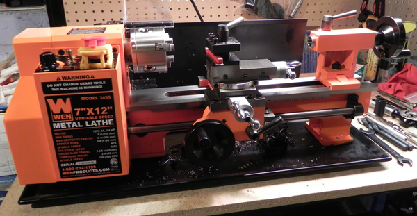

This is my lathe. Beautiful.

in March of 2019 I saw a brochure from Southern Maine Community College. They were offering a course in precision machining. I asked my son Mike if he wanted to take the course. He said we both can take the course, it would be fun to do something with me. Why would a 76 year old want to take a college course?

Hey, it's with my son who's a metal genius. And it indeed was fun.

We both learned how to work with huge lathes and milling machines.

After the course I bought my big lathe (7" x 12") above. I did have a small lathe, but it couldn't do some of the things I wanted to make.

The next post has some of the things we made.
