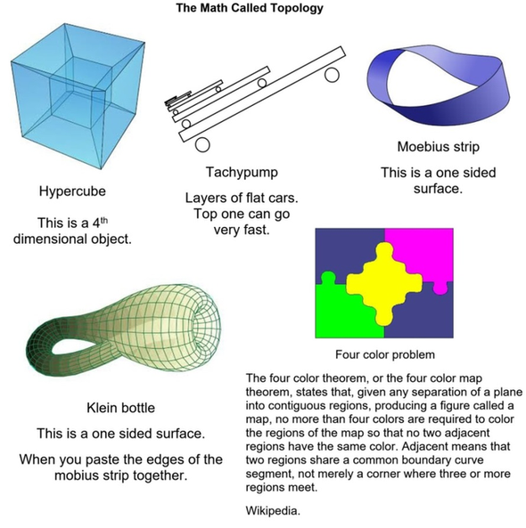

That image above is a Hyper Cube. 
It comes from the modern mathematics called Topology. My interest in it came about through my interest in Moebius strips. I read a book called _The Mathematical Magpie_, edited by Clifton Fadiman. It was a wonderful trip into fourth dimensional spaces and beyond. 
In the picture below, you’ll see some of the weird topological devices.  

